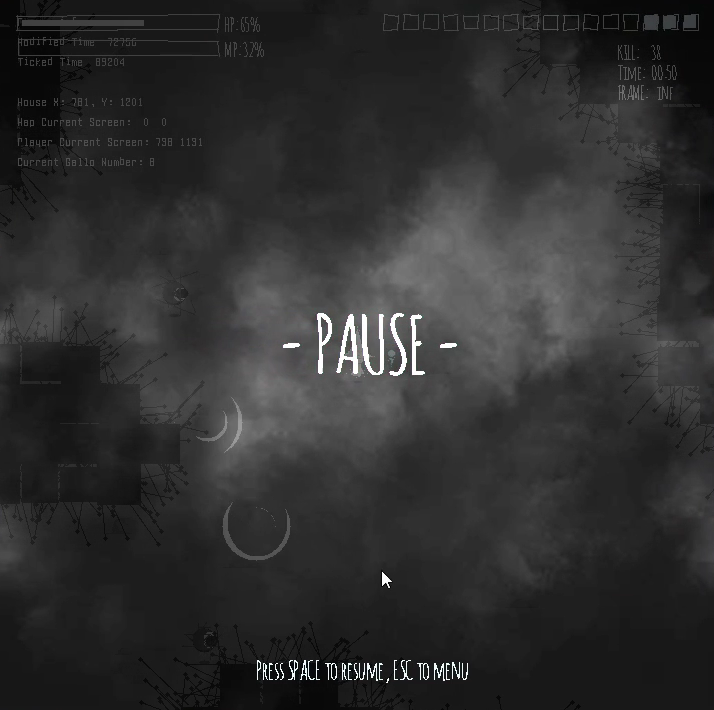

# Game Design : White Witch - Ziiky

##### COMP2006 - C++ Coursework 

| Name               | Student Number | Username |
| ------------------ | -------------- | -------- |
| Ziqi Yang (Daniel) | 16521586       | zy21586  |

---

About The Game:

This game called "Ziiky", which is an apprentice witch who can control thunder and lightning. The game follows the basic rules of classic cave exploration and survival game with some additional rules implemented. The aim of the game is that the witch has to activate all thunder runes and survival while defending incoming enemies, named Gallo. With each rune activated, it will release massive power to help Ziiky in the journey to find other runes.

Notes:

1.  All sprites and animations of the game are self-designed by Coding and Adobe Photoshop.
2.  All background images are self-designed by Adobe Photoshop.

---

  
<h1> 1. Build </h1>

    If you are running on Visual Studio 2019 (e.g. lab pcs), that is the default, so just run the CourseworkBase2021_vs2019.sln file which is in this directory.
    
    This is set up to use Visual Studio 2019. You can probably migrate it to later versions if you wish.
    
    When you build, the output executables will be placed in the Debug and Release directories in this folder.
    When you run the program from within visual studio, it will look for things like the fonts and images in the src directory.
    You MUST have the SDL dll files in your debug and release directories if you want to be able to run it. e.g. copy everything from the SDL/SDL2_dlls_x86 directory into your debug and release directories and it will find the SDL dlls that it needs to run.

  
<h1> 2. Framework & Engine </h1>

  

    
 1. GameObject & Inheritable

| Class / Design Pattern | Description                                                  |
| ---------------------- | ------------------------------------------------------------ |
| GameObject             | All game objects inherit from DisplayableObject class and will be contained and handled in the DisplayableObjectContainer.  Each game object is enhanced with a sprite and ImageMappingGeneralist(see below), which can display image with **rotation, translation and color Manipulation**. Each GameObject uses **center as coordinate** and saved as Vec2(see below) by default. |
| Inheritable Interfaces | As game object is still too general for all kinds of game items. We have more detailed interface/abstract class that are inheritable for GameObject. |
| BaseButton             | Specifying a game object that is an animated (see Animator&Animation class) button which can handle user mouse click/hover events. |
| Damageable             | Specifying a game object that can be damaged by attacks/spells by takeHit(int damage). |
| LivingEntity           | Subclass of Damageable, specifying a game object that has a life and can be killed (such as enemies, player). |
| Collidable             | Used together with CollisionSystem, specifying a game object can collide actively to others. |

  
2. Engine, Finite State Machine & Scene System

| Class / Design Pattern | Description                                                  |
| ---------------------- | ------------------------------------------------------------ |
| Engine                 | Inherited from BaseEngine, the engine's job is to initialize state machine, carry out update, fixed updates, detecting input and rendering pipeline and transfer the job to state machine to handle. |
| Finite State Machine   | The state machine receives jobs from engine and relays the job further to the current scenes(6 scenes:           MENU,     LOADING,     GAME,// gaming, pause, win(intermediate)     RESULT, // win     INSTRUCTION,     RECORD). It is state machine's job to determine and switch between scenes. |
| BaseScene              | The basic structure of each scene to handle different event such as onCreation, onDestroy, onActivate, onDeactivate.. |
| GameScene              | Where the player plays the game. Controls all the elements in the game: Map generator, enemy spawner, camera, environment render, UIs... Has three inner state as **Pause, Game over and Win**. |
| LoadingScene           | A Fake Loading Scene because we are doing mono-threading, the loading cannot really load under the scene, this scene is only for hiding the loading time and giving players a professional feeling. |
| MenuScene              | An animated Menu Scene with a interactable sand simulation system(see below) |
| IntroScene             | A zoomable and draggable scene with user manual.             |
| Result and Record      | Two similar scene shows the player the record made and the best. |

  
 3. Camera

| Class / Design Pattern | Description                                                  |
| ---------------------- | ------------------------------------------------------------ |
| GameCamera             | Camera class contains and handles FilterPoints like scaling and translation added on drawingSurface. GameCamera can be bind onto a specific game object (player in this game) and follow the game object while it moves.  1. GameCamera will add a strict limit when player approach the boundary of the map, instead of place the player as center, it will be restricted by the map boundary 2. GameCamera can handle simple camera effect like shaking. |
| ViewCamera             | ViewCamera is used in introScene to zoom and shrink the screen. |

  
 4. Animation System

| Class / Design Pattern | Description                                                  |
| ---------------------- | ------------------------------------------------------------ |
| Animator               | When a gameObject needs to display itself as aniamtion (with images), it is the animator's job to realize the current state of the game object, switch and display the animation accordingly. Each animator class is generated and initialized from template class code based on the state it will handle. E.g. player can have a player state with idle, running left, right and etc. Each animator has several animations according to different states. |
| Animation              | Each animation has several images/sprites as a set of frames and controls the fps of the animation. |

  
 5. Other System

| Class / Design Pattern | Description                                                  |
| ---------------------- | ------------------------------------------------------------ |
| TileManager            | A enhanced tile manager with empty and boundary check: SubClasses :CaveGenerator,  GroundRenderer, DeadWallSpawner,  RuneManager, ParticleMap.  See Feature Section below. |
| RecordManager          | Handles read/wirte to the record file and return result string list accordingly. |
| CollisionSystem        | Enhanced CollisionDetection class with checkObstacleBy(four)Square points |
| ImageMappingGeneralist | Can handle image translation, offseting, rotaion,hue, merging and brightness. |

  
 6. Utility Functions

| Class / Design Pattern | Description                                                  |
| ---------------------- | ------------------------------------------------------------ |
| debug                  | quick debug function by console output                       |
| transform functions    | direction enumeration, Vector2D struct, Position Pair struct, util-functions coping with **2d translation, indexing, 2d rotation, center rotation and some high-performance function(see performance section)** |
| math functions         | to implement **procedural animation**, I write some 2d & linear math function to use: **clamp**(with boundary), random generator(with boundary), **linear interpolation, ping-pong, smooth step.** |
| timeStr translation    | interpret time in second int to string with format.          |
| check contain          | template function to check if an object can be found inside a given list. |

  
<h1> 3. Features </h1>

  
 1. Map System

| Class / Design Pattern | Description                                                  |
| ---------------------- | ------------------------------------------------------------ |
| CaveGenerator          | This is a rouge-like survival game. Therefore, I made an auto-generated cave map with size 12800 * 7200 which the player can explore in the cave with a 720 * 720 sized camera following. 1. I implemented this by first randomly by given seed setting each tile type of the map as cave tile/empty ground tile and then using a **cellular-automata algorithm** to **smooth** the noised map several times(based on strength) to converge all same tiles to generate several caves.  2. After that, I implemented a **flood-fill algorithm** to get all caves I got and refine the map by eliminating the cave with invalid size (too small or too big). Finally, I implemented another modified **TSP AI algorithm** to connect all caves by finding the shortest path btw two tiles that are edges of every two caves and creating paths btw them by setting all tiles whose coordinates are overlapped by the lines btw these pairs of edges with a pre-set width.  3. When connecting caves, by making sure all caves are connected, I set the cave with the largest size as main cave and make each cave is either connected to the main cave or the cave it connected with is connected to the main room and recursively. Therefore, all caves are achievable by the player after this process. 4. During the generation, this generator will also initialize other tile types such as rune's position, dead walls, enemy spawning points and player's initial position. |
| RuneManger             | During the generation of cave map, before connection all the cave together, CaveGenerator will set runes' position as tile type in each cave. The number of runes in each cave is based on their size with a minimum value as 1. It's RuneManger's job to initialize runes and handle all events to each runes. |
| GroundRender           | This tile map as environment renderer will control the random environment features like fuzzy visual effect and different images of stones on the ground. |

  
 2. Player & Control

| Features                             | Description                                                  |
| ------------------------------------ | ------------------------------------------------------------ |
| Living Entity                        | the player is a subclass of LivingEntity which can be killed by enemies (named Gallo). |
| Image Animation                      | the player has 3 sets of 3-frame animations which are: idle, left, right. Note that the left and right animations are not simply mirrored because of the same direction of shadowing. |
| Visual Effect (procedural animation) | 1. When attacked by enemies (Gallo or DeadWall), the player sprite will flash with a lerped time interval to inform the player of the damage. 2. When the HP is lower than 20%,  the player sprite will be masked with red color to inform the player. |
| player controller                    | handles the user input with smoothened playing experience by check x/y collision separately to avoid some stark stops. |

  
 3. Enemies (Gallo & Dead Wall)

| Features          | Description                                                  |
| ----------------- | ------------------------------------------------------------ |
| Gallo             | 1. We have two types of enemies. Gallo is a subclass of LivingEntity which can be killed by the player. 2. **States**: gallo has 5 states and 4 behaviors. 3. **Inactive**: all dead/asleep gallos are inactive which are invisible and to be re-spawned by EnemySpawner 4. **Wander**: when gallos are far enough (300 radius) from the player, they just keep wandering in a random speed and to a random position (100 radius from current position in frequency as 5s max) while keep detecting the player. 5. **Chase**: when detecting the player, the gallo starts to chase the player with speed a little faster than player. The target position is updated in a pre-set frequency (1s per update) 6. **Attack**: when the gallo is close enough (50 radius) to the player, it starts to attack the player in a frequency of 0.3s with damage 30 (see animation below). 7. **Sleep**: when the gallo is even far enough (1000 radius) from the player and think the player will not be approached in a while, it stops wandering and makes itself sleep and waits for the EnemySpawner to awake it at a new position again near the player. 8. **OnDeath**: when killed by the player, the gallo starts to play the death effect before finally disappearing. (see animation below) |
| EnemySpawner      | All gallos are controlled by EnemySpawner.  1. the max number of gallos alive in the game: 25 max. 2. the interval of spawning is 0.8s 3. the position of each gallo spawned: 400 radius from player(outside the camera's view), to give the player a feeling that the enemies are already there. |
| Gallo's Animation | 1. All animations of all states of gallo are made by code (procedural animation) without image. 2. **Wander & Chase:** When wandering, the color of eyes of gallos are black with fuzzy feathers; when detecting and chasing the player, they turn to red. 3. **Attack**: When attacking the player, they transform to a new dark formation: 1. growing its size at a linear interpolated speed; 2. using their dark feathers to attack. 4. **Death**: On death, they transform to a new formation: 1. turning into white color; 2. growing its size at a linear interpolated speed while shrink their oval's width to vanish. 5. They display themselves based on left and right direction. |
| Dead Wall         | 1. This type of enemies is treated as dangerous environment, which is **undamageable** and player needs to avoid. 2. All dead walls are generated by DeadWallSpawner living on the edge of the cave. 3. When the player approaches, all walls around the player will be awake and start to attack the player at a short interval with lower damage (3). |

  
 4. Spell System

| Features                | Description                                                  |
| ----------------------- | ------------------------------------------------------------ |
| Wand                    | 1. There is a wand flying around the player which can cast Magic Bolt (projectile class in code)(trigger by mouse and support auto shooting when pressed). 2. The wand is a game object whose position controlled by the user's mouse position. The wand will always be around the player (35 radius) and facing the direction to the mouse cursor. 3. It is the wand's job to cast spell and produce projectiles to hit enemies.  4. The wand has a 2-frame animation with images. 5. To enhance a **smoothened experience,** I used states to control if the wands can produce magic bolts to allow the user keep firing when keeping the left mouse down instead of the need of clicking multiple times. 6. **There is no limit on cast magic bolts, fire as you wish!** |
| Magic Bolt (Projectile) | 1. Projectile is not a game object but rather a Collidable class contains information of the projectile position, when to explore, if hit enemies or walls.  2. It is the wand's job to render animation of each projectile based on their states. 3. **Flying**: when initialized with mouse direction, the projectile starts at the exact position of wand's orb and flies to that direction at speed 5. While flying, the bolt grows at the speed tuned by **smooth-step algorithm by lerp** until it hit some enemies, walls, or disappear if out of the camera's view. 4. **Explode**: when hit enemies or walls, it causes damages(1000 on gallo) and plays an explosion procedural animation by **implementing a ping-ping algorithm ** to bounce the size of the projectile while a blue cast shadow for delayed seconds (1s). |
| Thunder Zone            | As mentioned at the beginning, the player can control the power of thunder, here it is. 1. By pressing right button, a Thunder Zone will appear around the player and grow to a max radius. 2. All the enemies inside the Thunder Zone will be kill by Lightning strike (**Thunder bolt**). 3. However, this spell is too powerful so it consumes energy (MP). The MP will **resume** as time goes.  4. **Camera shaking**: when casting thunder zone, the game camera will be informed to handle a shaking effect!!! |
| Thunder Bolt            | 1. Its the Thunder Zone's job to initialize, control and render all thunder bolts, similar as Wand to Magic bolts. 2. The animation of each Thunder Bolt contains two types:  3. **Lightning strike by Procedural animation:** when initializing the thunder bolt, a list will push the end position as target's position and the add the start position as the top of target just a little above the view of camera so the player can have a feeling the thunder comes from the sky. Then based on the distance of two position. It will calculate and add number of internal position into the list with random offset to form the effect of a thunder strike. Finally, it will be played in a very short interval to simulate flash effect. 4. **Explosion effect by 2-frame animation with images**: cast  a explosion effect at the target position. |
| Runes                   | 1. All the runes are initialized in inactive state by RuneManager during map generation phase and controlled during the game. When the player approaches a rune and activates it, the rune will go into activating state and release powerful spell to kill all enemies around(400 radius) and finally go into active state delayed by 5 seconds. After that this rune will no longer be needed and will be removed from the DisplayableObjectContainer and deleted. |

  
 5. UI

| Features | Description |
| -------- | ----------- |
|          | ,           |
|          |             |
|          |             |
|          |             |

  
 6. Particle System - sand simulation

| Features       | Description                                                  |
| -------------- | ------------------------------------------------------------ |
| PaiticleSystem | I designed a particle system to simulate a sand simulation by cellular automata algorithm on the Menu Scene and loading Scene. 1. Inspired by famous game Noita: https://www.youtube.com/watch?v=prXuyMCgbTc 2. By click left mouse button, the user can generate more particles into the scene; by click right mouse button, the user can erase all the particles around the mouse position. And all other particles will simulated the sand behavior to fill the erased gap. 3. when the number of particles exceeds a specific number, the bottom level of particles will be eliminated to ensure there will not be too many of them! 4. Each particle is a struct contains a fixed color to simulated a noise effect of sand. |

  
<h1> 4. Performance Optimization </h1>

| Features | Description |
| -------- | ----------- |
| TBC      |             |
|          |             |
|          |             |
|          |             |

# 5. Demo Screenshots

### Loading Scene

### Game Demo

### Game Over

### Pause Scene

### Winner Scene

### User Manual

# 6. Demo Video
